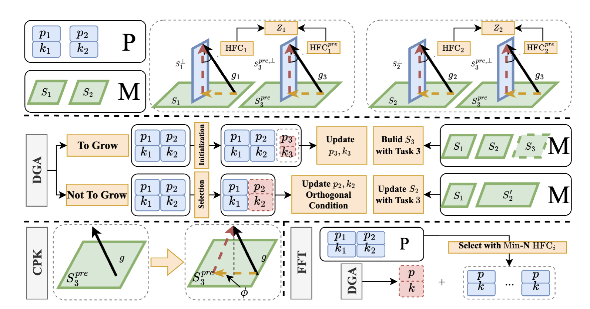

<div align="center">
  
  <div>
  <h1>LW2G: Learning Whether to Grow for Prompt-based Continual Learning</h1>
  </div>

  <div>
  </div>
  <br/>

</div>




Continual Learning (CL) aims to learn in non-stationary scenarios, progressively acquiring and maintaining knowledge from sequential tasks. The recent Prompt-based Continual Learning (PCL) approaches have achieved remarkable performance by leveraging the Pre-Trained Models (PTMs). These approaches grow the pool by adding a new set of prompts when learning each new task (prompt learning) and adopt a matching mechanism to select the correct set for each testing sample (prompt retrieval). Previous studies make efforts on improving the matching mechanism to enhance Prompt Retrieval Accuracy (PRA). Inspired by humans' integration of information, we propose to dynamically learn whether to grow a new set of prompts during prompt learning based on the disparities between tasks, rather than crudely growing for each task. Specifically, when several tasks share certain commonalities, they can utilize a shared set of prompts. Conversely, when tasks exhibit significant differences, a new set should be added. In this paper, we propose a plug-in module with PCL to Learn Whether to Grow (LW2G). In LW2G, we surgically modify the gradients of the new task with Gradient Projection Continual Learning (GPCL), thereby encoding the knowledge from multiple tasks into a single set of prompts (opting not to grow). Furthermore, we introduce a metric called Hinder Forward Capability (HFC) to measure the hindrance imposed on learning new tasks under the strict orthogonal condition in GPCL, while also quantifying the disparities between new and old tasks. Hence, when learning new tasks is severely impeded, it is warranted to dynamically opt to grow a new set. Extensive experiments show the effectiveness of our method. 


## Requirements
- Python 3.6+  
```pip install -r requirements.txt```

## Experimental Setup
Our code has been tested on four datasets: CIFAR-100, ImageNet-R, CUB-200 and Omnibenchmark:
### Dataset
- [CIFAR-100](https://www.cs.toronto.edu/~kriz/cifar-100-python.tar.gz)
- [Imagenet-R](https://people.eecs.berkeley.edu/~hendrycks/imagenet-r.tar)
- [CUB-200](https://data.caltech.edu/records/65de6-vp158/files/CUB_200_2011.tgz)
- [Omnibenchmark](https://drive.google.com/file/d/1AbCP3zBMtv_TDXJypOCnOgX8hJmvJm3u/view?usp=sharing)

### Supervised and Self-supervised Checkpoints
We incorporated the following supervised and self-supervised checkpoints as backbones:
- [Sup-21K VIT](https://storage.googleapis.com/vit_models/imagenet21k/ViT-B_16.npz)
- [iBOT-21K](https://lf3-nlp-opensource.bytetos.com/obj/nlp-opensource/archive/2022/ibot/vitb_16_pt22k/checkpoint.pth)
- [iBOT](https://lf3-nlp-opensource.bytetos.com/obj/nlp-opensource/archive/2022/ibot/vitb_16/checkpoint_teacher.pth)
- [DINO](https://dl.fbaipublicfiles.com/dino/dino_vitbase16_pretrain/dino_vitbase16_pretrain.pth)  
  
Please download the self-supervised checkpoints and put them in the /checkpoints/{checkpoint_name} directory.

## Usage
To reproduce the results mentioned in our paper, execute as follows:
```
bash new_bash/typical_run_all/typical_setting_run.bash
```
Meanwhile, the results from baslines can also be reproduced as follows:
```
bash new_bash/typical_run_all/typical_setting_run_baseline.bash
```
##### Note

##### 1.HidePrompt is a two-stage methods, please follow the official hideprompt code [HidePrompt](https://github.com/thu-ml/HiDe-Prompt) to get the ckpt from the 1-st stage, and put then in the: (an example)
```
'HIDEP_CKPT_cifar='./ckpt_for_hidep/cifar/cifar_b_0_inc_10/cifar100_hideprompt_5e/test_20279'
```
or change the path of ckpt in typical_setting_run.bash and typical_setting_run_baseline.bash

##### 2. We also find some implemtations errors in the official code in [DualPrompt](https://github.com/JH-LEE-KR/dualprompt-pytorch) and [HidePrompt](https://github.com/thu-ml/HiDe-Prompt), details can be found in Appendix D.2 in our paper.

##### 3. We set `batchwise_prompt=False` for all comparing baselines and our methods, thereby more clearly demonstrating the improvement of LW2G in prompt retrieval.


## Acknowledgement
The implentation of Prompt-based continual learning is based on [HidePrompt](https://github.com/thu-ml/HiDe-Prompt). And the implentation of the orthoganol condition in gradient-based continual learning is based on [PGP](https://github.com/JingyangQiao/prompt-gradient-projection).

Many thanks to its contributors!


