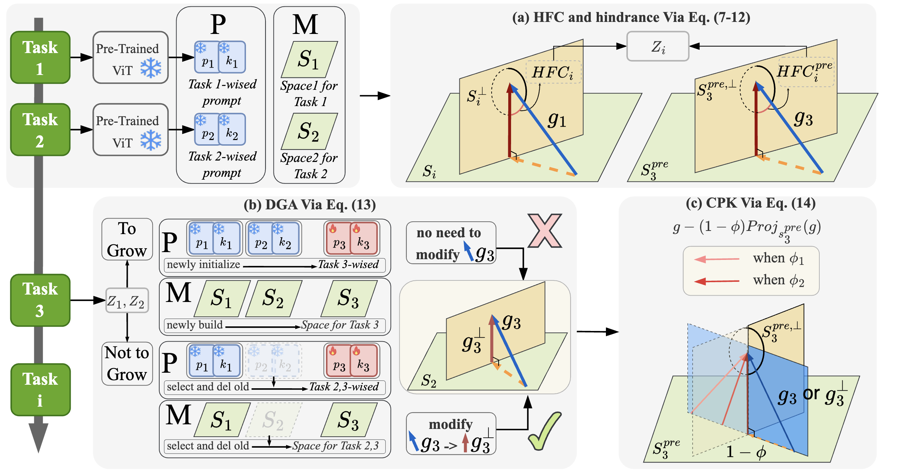

<div align="center">
  
  <div>
  <h1>LW2G: Learning Whether to Grow for Prompt-based Continual Learning</h1>
  </div>

  <div>
  </div>
  <br/>

</div>




Recent Prompt-based Continual learning (PCL) has achieved remarkable performance with pre-trained models. These approaches expand a prompt pool by adding a new set of prompts while learning and select the correct set during inference. Previous studies have revealed that learning task-wised prompt sets individually and low selection accuracy pose challenges to the performance of PCL. In this paper, we propose a plug-in module, \textbf{Learn Whether to Grow (LW2G)}, which leverages the disparities between tasks to form an effective and efficient prompt sets pool, thereby promoting cross-task knowledge facilitation and avoiding the unbounded increase in the cost of the prompt pool. Specifically, a shared set is utilized when several tasks share certain commonalities, and a new set is added when there are significant differences between the new and previous tasks. To achieve this, we develop a metric called Hinder Forward Capability (HFC) to measure the hindrance imposed on learning new tasks by surgically modifying the original gradient onto the orthogonal complement of the old feature space. With HFC, an automated scheme, Dynamic Growing Approach, adaptively learns whether to grow with a dynamic threshold. Furthermore, we design a gradient-based constraint to ensure consistency between the updating prompts and pre-trained knowledge. Extensive experiments show the effectiveness of our method.


## Requirements
- Python 3.6+  
```pip install -r requirements.txt```

## Experimental Setup
Our code has been tested on four datasets: CIFAR-100, ImageNet-R, CUB-200 and Omnibenchmark:
### Dataset
- [CIFAR-100](https://www.cs.toronto.edu/~kriz/cifar-100-python.tar.gz)
- [Imagenet-R](https://people.eecs.berkeley.edu/~hendrycks/imagenet-r.tar)
- [CUB-200](https://data.caltech.edu/records/65de6-vp158/files/CUB_200_2011.tgz)
- [Omnibenchmark](https://drive.google.com/file/d/1AbCP3zBMtv_TDXJypOCnOgX8hJmvJm3u/view?usp=sharing)

### Supervised and Self-supervised Checkpoints
We incorporated the following supervised and self-supervised checkpoints as backbones:
- [Sup-21K VIT](https://storage.googleapis.com/vit_models/imagenet21k/ViT-B_16.npz)
- [iBOT-21K](https://lf3-nlp-opensource.bytetos.com/obj/nlp-opensource/archive/2022/ibot/vitb_16_pt22k/checkpoint.pth)
- [iBOT](https://lf3-nlp-opensource.bytetos.com/obj/nlp-opensource/archive/2022/ibot/vitb_16/checkpoint_teacher.pth)
- [DINO](https://dl.fbaipublicfiles.com/dino/dino_vitbase16_pretrain/dino_vitbase16_pretrain.pth)  
  
Please download the self-supervised checkpoints and put them in the /checkpoints/{checkpoint_name} directory.

## Usage
To reproduce the results mentioned in our paper, execute as follows:
```
bash new_bash/typical_run_all/typical_setting_run.bash
```
Meanwhile, the results from baslines can also be reproduced as follows:
```
bash new_bash/typical_run_all/typical_setting_run_baseline.bash
```
##### Note

##### 1.HidePrompt is a two-stage methods, please follow the official hideprompt code [HidePrompt](https://github.com/thu-ml/HiDe-Prompt) to get the ckpt from the 1-st stage, and put then in the: (an example)
```
'HIDEP_CKPT_cifar='./ckpt_for_hidep/cifar/cifar_b_0_inc_10/cifar100_hideprompt_5e/test_20279'
```
or change the path of ckpt in typical_setting_run.bash and typical_setting_run_baseline.bash

##### 2. We also find some implemtations errors in the official code in [DualPrompt](https://github.com/JH-LEE-KR/dualprompt-pytorch) and [HidePrompt](https://github.com/thu-ml/HiDe-Prompt), details can be found in Appendix D.2 in our paper.

##### 3. We set `batchwise_prompt=False` for all comparing baselines and our methods, thereby more clearly demonstrating the improvement of LW2G in prompt retrieval.


## Acknowledgement
The implentation of Prompt-based continual learning is based on [HidePrompt](https://github.com/thu-ml/HiDe-Prompt). And the implentation of the orthoganol condition in gradient-based continual learning is based on [PGP](https://github.com/JingyangQiao/prompt-gradient-projection).

Many thanks to its contributors!


