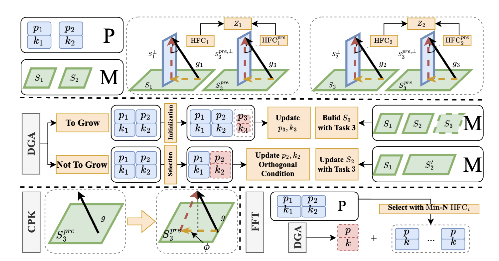

  
  

  <h1>LW2G: Learning Whether to Grow for Prompt-based Continual Learning</h1>
  

  

  

   

Recent Prompt-based Continual learning (PCL) has achieved remarkable performance with pre-trained models. These approaches expand a prompt pool by adding a new set of prompts while learning and select the correct set during inference. Previous studies have revealed that learning task-wised prompt sets individually and low selection accuracy pose challenges to the performance of PCL. In this paper, we propose a plug-in module, \textbf{Learn Whether to Grow (LW2G)}, which leverages the disparities between tasks to form an effective and efficient prompt sets pool, thereby promoting cross-task knowledge facilitation and avoiding the unbounded increase in the cost of the prompt pool. Specifically, a shared set is utilized when several tasks share certain commonalities, and a new set is added when there are significant differences between the new and previous tasks. To achieve this, we develop a metric called Hinder Forward Capability (HFC) to measure the hindrance imposed on learning new tasks by surgically modifying the original gradient onto the orthogonal complement of the old feature space. With HFC, an automated scheme, Dynamic Growing Approach, adaptively learns whether to grow with a dynamic threshold. Furthermore, we design a gradient-based constraint to ensure consistency between the updating prompts and pre-trained knowledge. Extensive experiments show the effectiveness of our method.

# Note
We first need to explain that HidePrompt is a two-stage method. In the first stage, it trains an adapter for retrieval. In the second stage, it gradually increases the set of prompts for each task. Since LW2G does not make any changes to the first stage but acts as a plug-in module in the second stage, we choose to reuse HidePrompt's official code to generate the checkpoint for the first stage. The generation process strictly follows HidePrompt's official code.

Therefore, to reproduce HidePrompt [+ LW2G] and its baseline on each benchmarks, we must first execute the following three steps to fetch the checkpoint from the first stage, and then proceed with the LW2G training.

For DualPrompt and S-Prompt++, since they are end-to-end training methods, we can directly train LW2G.

# CIFAR

### 1 To reproduced the results of HidePrompt [ + LW2G] and its coresponing baseline HidePrompt on CIFAR.

1. `cd HiDe-Prompt-main_after_modified/`
2. `bash new_bash/hideprompt_cifar_prepare.bash`
3. `mv ckpt_for_hidep/ ../LW2G`
4. `cd ../LW2G`
5. `bash new_bash/cifar/hideprompt_lw2g.bash` and `bash new_bash/cifar/hideprompt.bash`

### 2 To reproduced the results of DualPrompt [ + LW2G] and its coresponing baseline DualPrompt on CIFAR.

1. `cd LW2G/`
2. `bash new_bash/cifar/dualprompt_lw2g.bash` and `bash new_bash/cifar/dualprompt.bash`

# IMR

### 1 To reproduced the results of HidePrompt [ + LW2G] and its coresponing baseline HidePrompt on IMR.

1. `cd HiDe-Prompt-main_after_modified/`
2. `bash new_bash/hideprompt_imr_prepare.bash`
3. `mv ckpt_for_hidep/ ../LW2G`
4. `cd ../LW2G`
5. `bash new_bash/imr/hideprompt_lw2g.bash` and `bash new_bash/imr/hideprompt.bash`

### 2 To reproduced the results of DualPrompt [ + LW2G] and its coresponing baseline DualPrompt on IMR.

1. `cd LW2G/`
2. `bash new_bash/imr/dualprompt_lw2g.bash` and `bash new_bash/imr/dualprompt.bash`

# CUB

### 1 To reproduced the results of HidePrompt [ + LW2G] and its coresponing baseline HidePrompt on CUB.

1. `cd HiDe-Prompt-main_after_modified/`
2. `bash new_bash/hideprompt_cub_prepare.bash`
3. `mv ckpt_for_hidep/ ../LW2G`
4. `cd ../LW2G`
5. `bash new_bash/cub/hideprompt_lw2g.bash` and `bash new_bash/cub/hideprompt.bash`

### 2 To reproduced the results of DualPrompt [ + LW2G] and its coresponing baseline DualPrompt on CUB.

1. `cd LW2G/`
2. `bash new_bash/cub/dualprompt_lw2g.bash` and `bash new_bash/cub/dualprompt.bash`

# Logs

Due to potential factors such as the experimental environment and CUDA version, as well as variations in configurations when using DDP for multi-node, multi-GPU training in the first stage of HidePrompt, the resulting checkpoints may differ. Therefore, we have provided all training logs at:

`
./LW2G/all_logs/
`

# Envs

Please refer to `./issue2/LW2G/requirements.txt`.

## Acknowledgement
The implentation of Prompt-based continual learning is based on [HidePrompt](https://github.com/thu-ml/HiDe-Prompt). And the implentation of the orthoganol condition in gradient-based continual learning is based on [PGP](https://github.com/JingyangQiao/prompt-gradient-projection).

Many thanks to its contributors!

